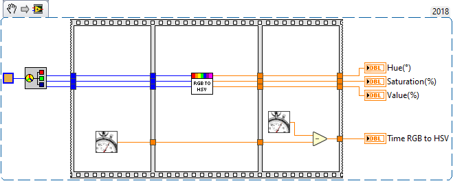
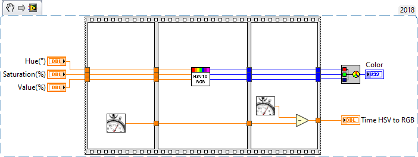
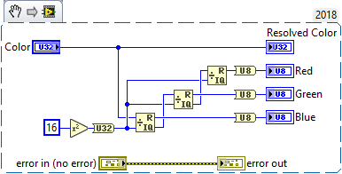
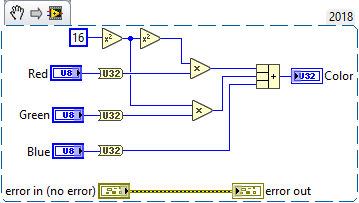
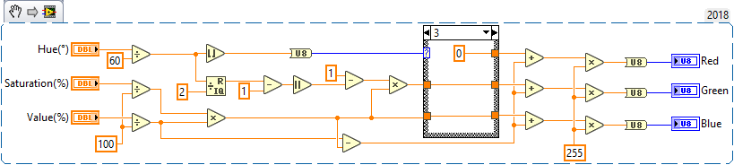
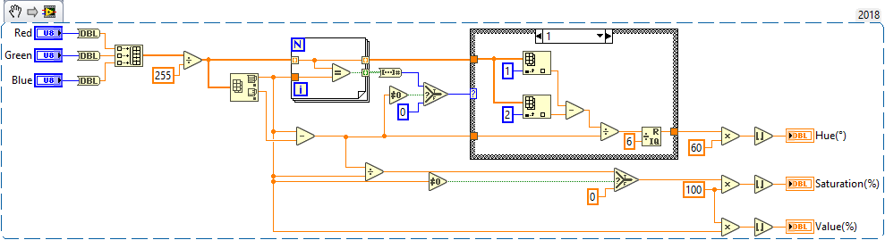
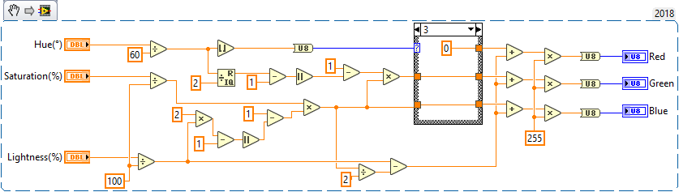
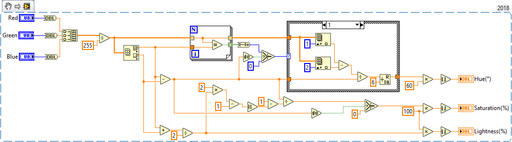

# LabVIEW Colour Lab
A LabVIEW toolkit for fast and simple RGB, HSV, HSL, CMYK, HEX or DEC colour manipulation

**The Project includes the following tools/VIs:**

- [x] Benchmark Tests
- [x] CMYK to Colour
- [x] CMYK to RGB
- [x] Colour to CMYK
- [x] Colour to HSL
- [x] Colour to HSV
- [x] Colour to RGB
- [x] HSL to Colour
- [x] HSL to RGB
- [x] HSV to Colour
- [x] HSV to RGB
- [x] RGB to CMYK
- [x] RGB to Colour
- [x] RGB to HSL
- [x] RGB to HSV

Note: Colour can be represented as a DEC or HEX in LabVIEW

# Minimum Requirements
* LabVIEW 2018 (32/64 bit)

# Code Snippets

 **Benchmarks:**

- - - -

**Colour to RGB:** 

- - - -
**RGB to Colour:** 

- - - -
**HSV to RGB:** 

*Equation located on [www.rapidtables.com](https://www.rapidtables.com/convert/color/hsv-to-rgb.html) 
- - - -
**RGB to HSV:** 

*Equation located on [www.rapidtables.com](https://www.rapidtables.com/convert/color/rgb-to-hsv.html) 
- - - -
**HSL to RGB:** 

*Equation located on [www.rapidtables.com](https://www.rapidtables.com/convert/color/hsl-to-rgb.html) 
- - - -
**RGB to HSL:** 

*Equation located on [www.rapidtables.com](https://www.rapidtables.com/convert/color/rgb-to-hsl.html) 