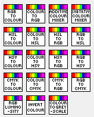
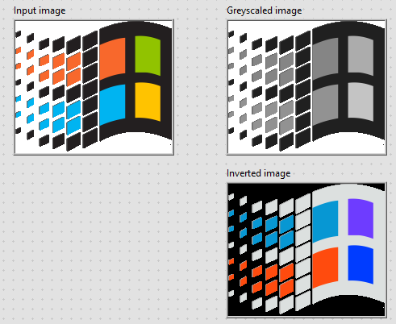
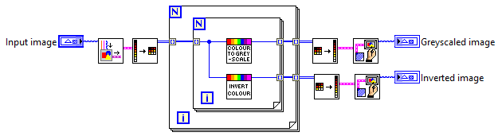

# LabVIEW Colour Lab
A LabVIEW toolkit for colour manipulation.

**The Project includes the following tools/VIs:**

- [x] Benchmark Tests
- [x] CMYK to Colour
- [x] CMYK to RGB
- [x] Colour to CMYK
- [x] Colour to HSL
- [x] Colour to HSV
- [x] Colour to RGB
- [x] HSL to Colour
- [x] HSL to RGB
- [x] HSV to Colour
- [x] HSV to RGB
- [x] RGB to CMYK
- [x] RGB to Colour
- [x] RGB to HSL
- [x] RGB to HSV
- [x] Additive Colour Mixer
- [x] Subtractive Colour Mixer
- [x] RGB Luminosity
- [x] Colour to Greyscale
- [x] Invert Colour

Note: Colour can be represented as a DEC or HEX in LabVIEW

# Minimum Requirements
* LabVIEW 2018 (32/64 bit) and above

# Showcase

# Example

